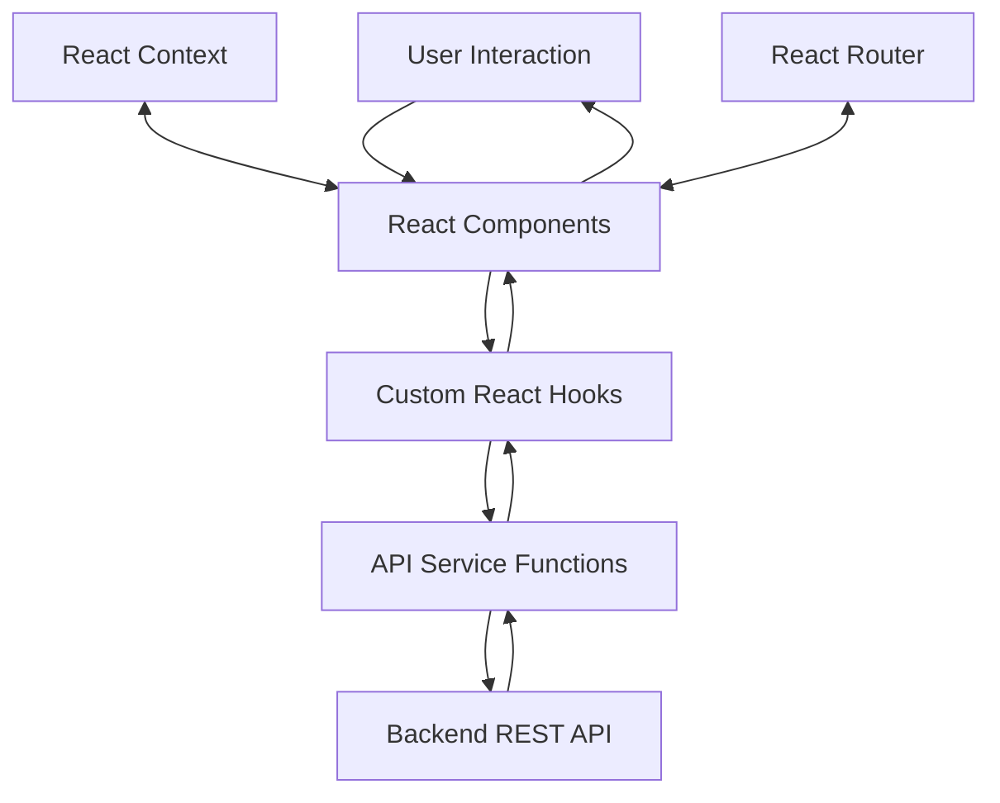
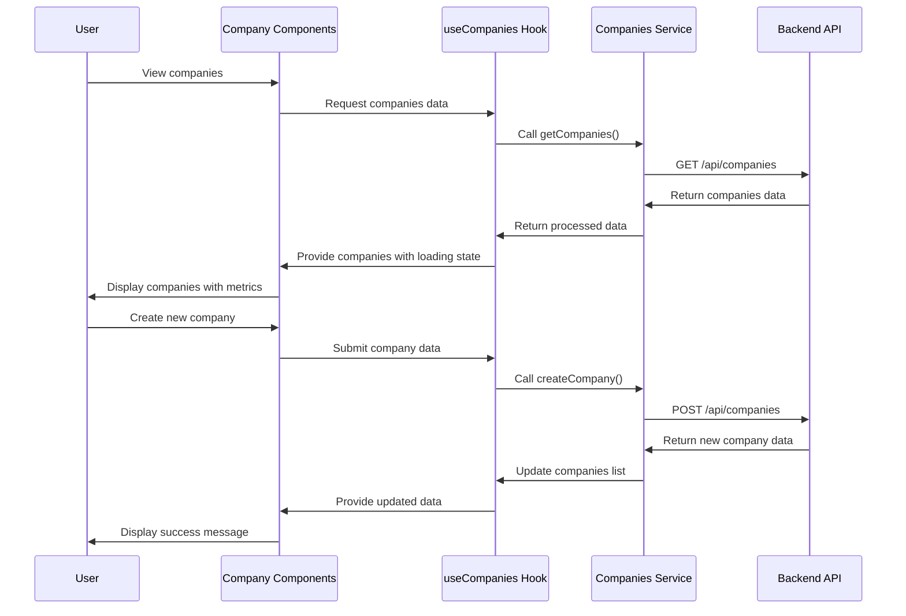
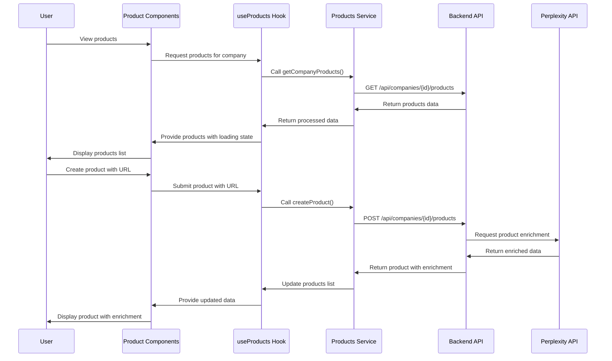
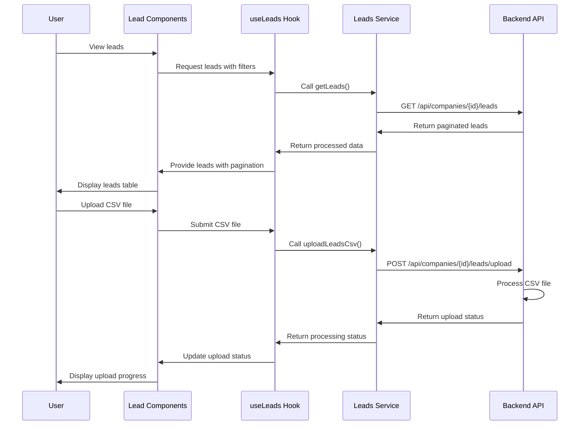
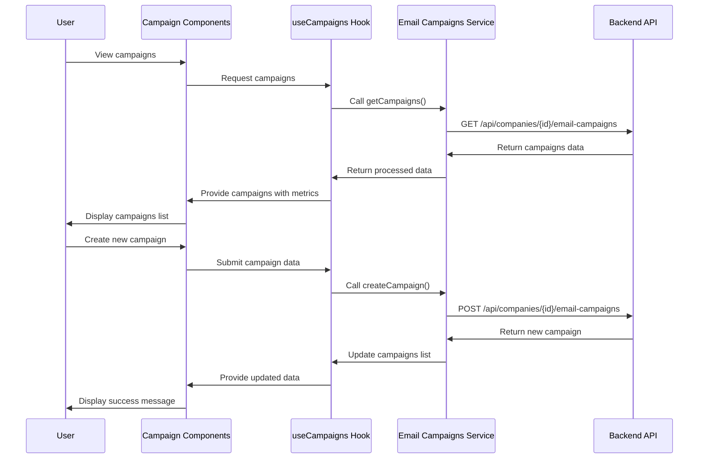
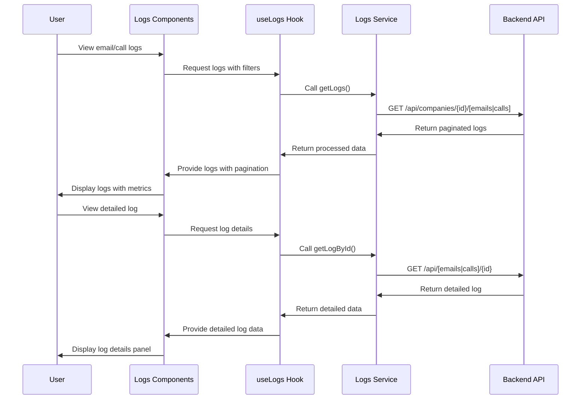

# ReachGenie Application Data Flow

## Overview

This document outlines the data flow architecture of the ReachGenie application, focusing on how data moves through the system from user interactions to backend services and back to the user interface.

## Core Data Entities

ReachGenie manages several key data entities:

1. **Companies**: The top-level organization unit
2. **Products**: Products or services offered by companies
3. **Leads**: Potential customers associated with companies/products
4. **Email Campaigns**: Structured email outreach efforts
5. **Call Logs**: Records of customer calls
6. **Email Logs**: Records of email interactions

## Data Flow Architecture

ReachGenie follows a typical React frontend architecture with clear separation between UI components, data fetching, and state management:



## Detailed Data Flows

### 1. Company Management Flow



### 2. Product Management Flow



### 3. Lead Management Flow



### 4. Email Campaign Flow



### 5. Communication Logs Flow



## State Management

ReachGenie uses several approaches for state management:

### 1. React Context

React Context is used for global state that needs to be accessed by many components:

- **ThemeContext**: Manages application theme (light/dark)
- **ToastContext**: Manages global toast notifications

### 2. Custom Hooks

Custom hooks encapsulate data fetching and state management for specific features:

- **useAuth**: Authentication state and operations
- **useCompanies**: Company data and operations
- **useProducts**: Product data and operations
- **useLeads**: Lead data and operations
- **useEmailCampaigns**: Email campaign data and operations
- **useCallLogs**: Call log data and operations
- **useEmailLogs**: Email log data and operations

Each custom hook typically manages:
- Data fetching and caching
- Loading states
- Error handling
- CRUD operations
- Pagination (where applicable)

### 3. Component State

Local component state is used for UI-specific state that doesn't need to be shared:

- Form values and validation
- UI toggling (expanded/collapsed)
- Temporary UI state

## API Integration

The application communicates with a backend REST API using service functions:

### Service Layer Pattern

Each service encapsulates API calls for a specific domain:

```typescript
// Example service function
export async function getCompanies(token: string): Promise<Company[]> {
  try {
    const response = await fetch(`${apiEndpoints.companies}`, {
      headers: {
        'Authorization': `Bearer ${token}`,
        'Content-Type': 'application/json'
      }
    });
    
    if (!response.ok) {
      throw new Error('Failed to fetch companies');
    }
    
    return await response.json();
  } catch (error) {
    console.error('Error fetching companies:', error);
    throw error;
  }
}
```

### API Request Flow

1. **Component** calls a custom hook method
2. **Custom hook** calls the appropriate service function
3. **Service function** makes the API request with proper headers
4. **Service function** handles the response and error cases
5. **Custom hook** processes the data and updates state
6. **Component** renders based on the updated state

## Error Handling

ReachGenie implements a consistent error handling strategy:

1. **Service Layer Errors**: Caught and propagated up with context
2. **Hook Layer Errors**: Managed and exposed to components
3. **Component Error Displays**: Toast notifications and inline error messages
4. **Global Error Boundary**: Catches unexpected errors

```typescript
// Example error handling in a custom hook
export function useCompanies() {
  const [companies, setCompanies] = useState<Company[]>([]);
  const [loading, setLoading] = useState(false);
  const [error, setError] = useState<Error | null>(null);
  const { showToast } = useToast();
  
  const fetchCompanies = async () => {
    setLoading(true);
    setError(null);
    
    try {
      const token = getToken();
      const data = await getCompanies(token);
      setCompanies(data);
    } catch (err) {
      setError(err as Error);
      showToast({
        type: 'error',
        message: 'Failed to load companies. Please try again.'
      });
    } finally {
      setLoading(false);
    }
  };
  
  // Rest of the hook...
}
```

## Authentication Flow

Authentication data flows through these steps:

1. **Login/Signup**: User submits credentials via auth forms
2. **Auth Service**: Calls backend authentication endpoints
3. **Token Storage**: JWT token stored in localStorage
4. **Auth State**: Updated via useAuth hook
5. **Protected Requests**: Token included in all authenticated requests
6. **Token Refresh**: Automatic token refresh when needed
7. **Logout**: Token removed and state reset

## Pagination and Filtering

For lists with large datasets, the application implements pagination and filtering:

1. **UI Controls**: Components provide filtering and pagination controls
2. **State Management**: Hooks track current page and filters
3. **API Requests**: Include pagination parameters and filters
4. **Response Handling**: Process paginated responses with metadata
5. **UI Updates**: Display current page data and pagination controls

## Real-time Updates

Some features may implement polling or WebSocket connections for real-time updates:

1. **Polling**: Regular API calls at set intervals for fresh data
2. **Data Merging**: New data merged with existing state
3. **UI Updates**: Components re-render with updated data

## Conclusion

ReachGenie's data flow architecture follows a clean, maintainable pattern that separates concerns between UI components, data fetching, and state management. This approach ensures the application remains performant, maintainable, and scalable as new features are added. 