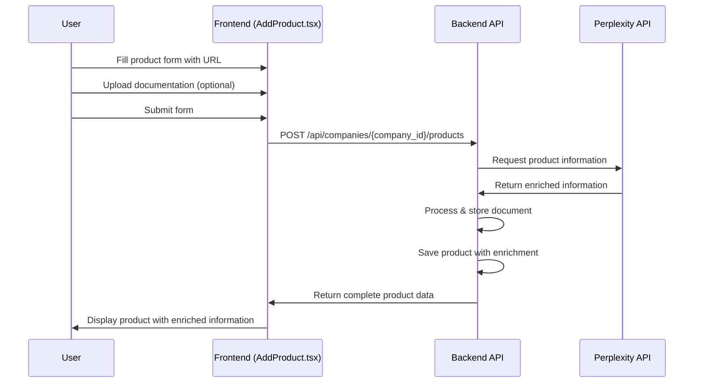

# Product Enrichment Feature: Technical Flow

## Overview

The Product Enrichment feature allows users to enhance product information through automated AI-powered processing. This document outlines the technical architecture and flow of this feature within the ReachGenie application.

## Feature Components

The product enrichment flow consists of several key components:

1. **Frontend Components**
   - `AddProduct.tsx`: Form component for creating products with enrichment capability
   - `EditProduct.tsx`: Form component for editing products with enrichment capability
   - `EnrichedProductInfo.tsx`: Component for displaying AI-enriched product data
   - `CompanyProducts.tsx`: List view showing products with enrichment status

2. **Backend Services**
   - Perplexity API Integration: Used for scraping and analyzing product information
   - File Processing: Handles documentation uploads and extraction

3. **Data Models**
   - Product with enriched_information field storing the AI-generated content

## Technical Flow

### 1. Product Creation with Enrichment



### 2. Data Processing Flow

1. **Form Submission**:
   - User provides product_name (required), description (optional), product_url (optional), and file (optional)
   - Data is submitted as `multipart/form-data`

2. **Backend Processing**:
   - If product_url is provided:
     - Backend calls Perplexity API with company name and product URL
     - Perplexity analyzes the website and extracts information
     - Information is structured into predefined categories
   - If file is uploaded:
     - File is processed and stored
     - Original filename and generated filename are recorded

3. **Enrichment Structure**:
   - The enriched_information object contains:
     - overview: General description
     - key_value_proposition: Main selling points
     - pricing: Pricing information
     - reviews: Up to 3 good reviews
     - market_overview: Information about the market
     - competitors: List of competitors

4. **Response Handling**:
   - Frontend receives complete product data with enrichment
   - UI is updated to display the enriched information

### 3. Frontend Implementation

The frontend implementation follows these steps:

1. **Form Creation**: 
   - Create a form with fields for product information including URL and file upload
   - Implement proper validation and loading states

2. **Form Submission**:
   - Create FormData object with all fields
   - Make API request with multipart/form-data content type
   - Show loading state during processing

3. **Display Enriched Information**:
   - Use the EnrichedProductInfo component to display the structured data
   - Implement responsive design for different screen sizes
   - Add toggle functionality for showing/hiding detailed information

### 4. API Contract

**Request Format:**
```javascript
// POST /api/companies/{company_id}/products
const formData = new FormData();
formData.append('product_name', productName); // Required
formData.append('description', description);   // Optional
formData.append('product_url', productUrl);    // Optional - Triggers enrichment
formData.append('file', file);                 // Optional - File upload
```

**Response Format:**
```json
{
  "id": "uuid-string",
  "company_id": "company-uuid-string",
  "product_name": "Product Name",
  "description": "Product description...",
  "product_url": "https://example.com/product",
  "file_name": "uuid-filename.pdf",
  "original_filename": "original-filename.pdf",
  "enriched_information": {
    "overview": "Product overview...",
    "key_value_proposition": "Key value proposition...",
    "pricing": "Pricing information...",
    "reviews": ["Review 1", "Review 2", "Review 3"],
    "market_overview": "Market overview...",
    "competitors": "List of competitors..."
  },
  "created_at": "2023-01-01T00:00:00Z",
  "deleted": false
}
```

## Implementation Details

### 1. Product Form Component

The product form component needs to:
- Handle both text fields and file uploads
- Show loading states during form submission
- Provide clear feedback about the enrichment process
- Display validation errors

### 2. Enriched Information Display

The EnrichedProductInfo component:
- Displays each section of enriched information
- Handles missing data gracefully
- Provides a clean, organized view of the information
- Is responsive across different screen sizes

### 3. Error Handling

The implementation includes robust error handling:
- Validation errors for required fields
- Error messages for upload failures
- Fallback for enrichment failures
- Network error handling

## Future Enhancements

Potential future enhancements to the product enrichment flow:

1. **Manual Editing**: Allow users to edit AI-generated content
2. **Enrichment Analytics**: Track how enrichment improves product engagement
3. **Additional Data Sources**: Integrate with more sources for enrichment
4. **Custom Enrichment Rules**: Allow users to specify what information to prioritize
5. **Batch Enrichment**: Enable enrichment for multiple products simultaneously

## Conclusion

The product enrichment feature leverages AI to enhance product information with minimal user effort. This technical documentation provides a comprehensive overview of how the feature is implemented, the data flow, and the components involved.

For more detailed implementation guidelines, refer to the [Product Enrichment Guide](./product-enrichment-guide.md). 